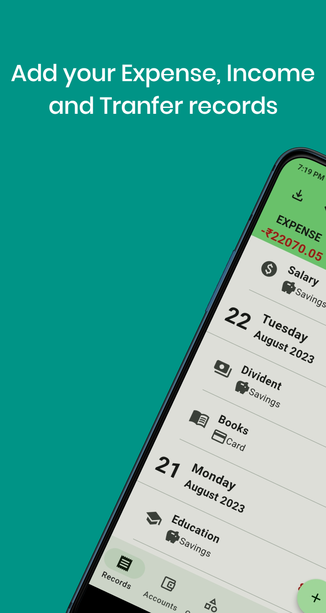
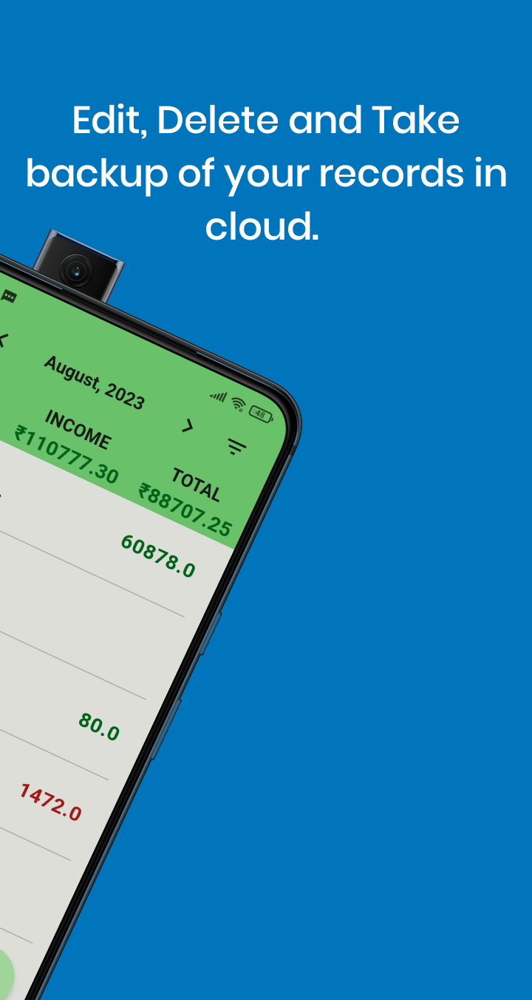
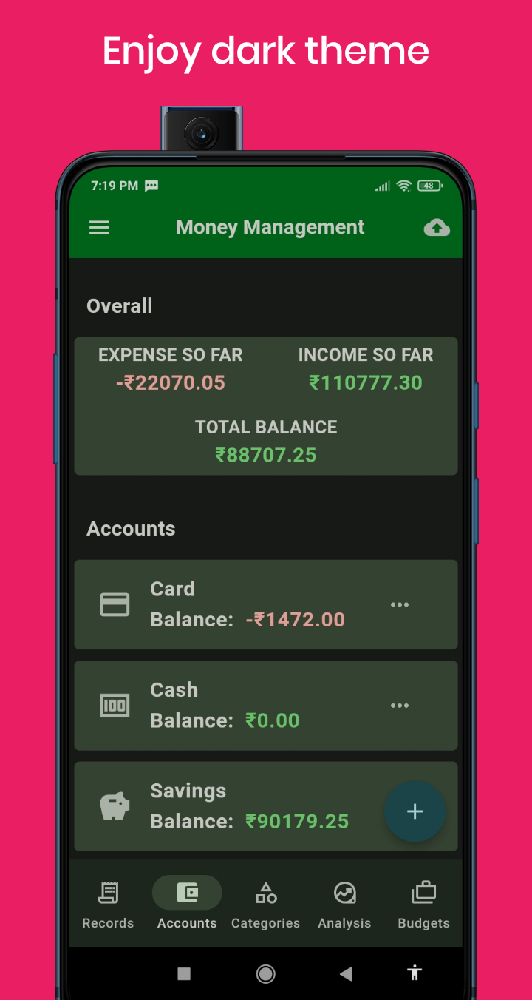
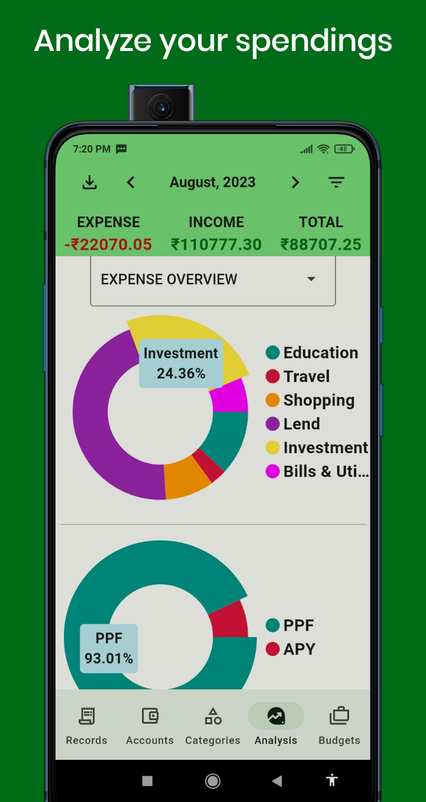
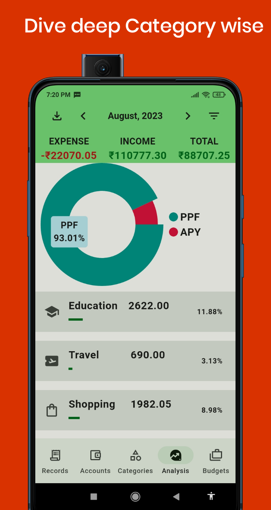
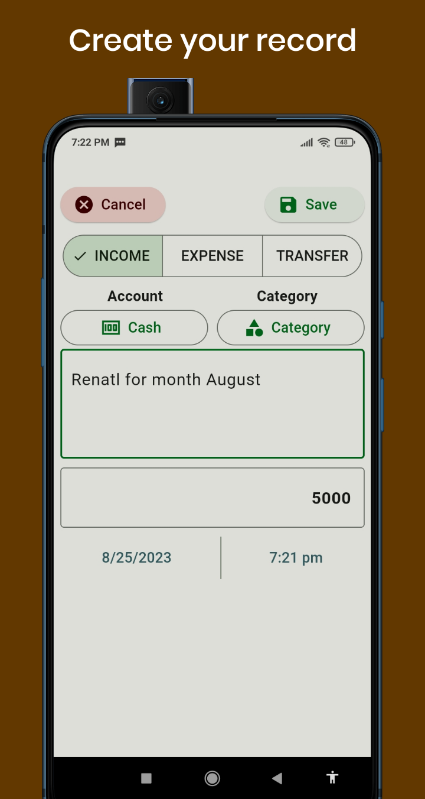
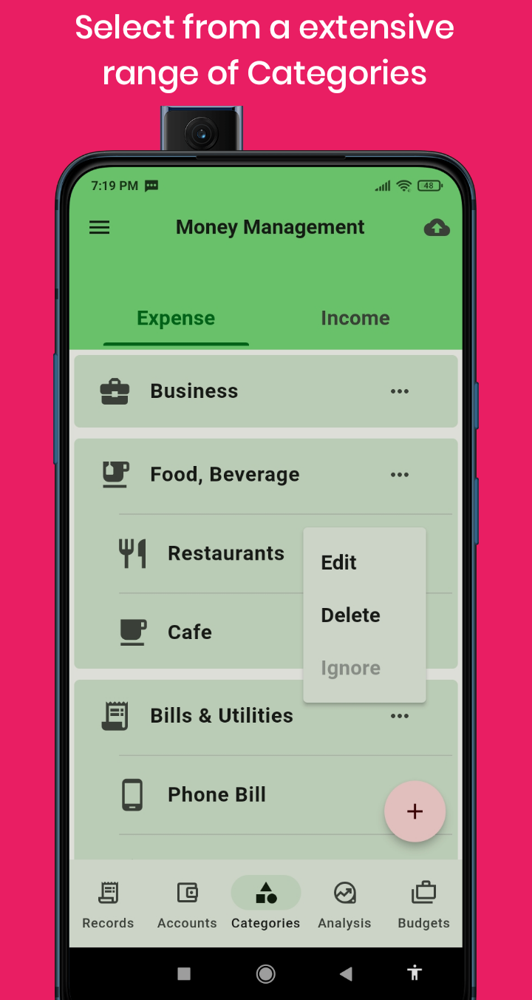
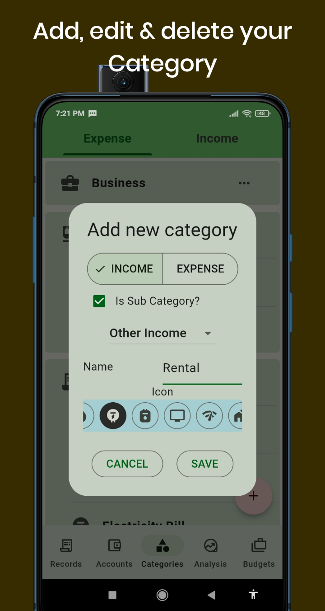

<!-- Improved compatibility of back to top link: See: https://github.com/othneildrew/Best-README-Template/pull/73 -->
<a id="readme-top"></a>
<!--
*** Thanks for checking out the Best-README-Template. If you have a suggestion
*** that would make this better, please fork the repo and create a pull request
*** or simply open an issue with the tag "enhancement".
*** Don't forget to give the project a star!
*** Thanks again! Now go create something AMAZING! :D
-->


<!-- PROJECT SHIELDS -->
<!--
*** I'm using markdown "reference style" links for readability.
*** Reference links are enclosed in brackets [ ] instead of parentheses ( ).
*** See the bottom of this document for the declaration of the reference variables
*** for contributors-url, forks-url, etc. This is an optional, concise syntax you may use.
*** https://www.markdownguide.org/basic-syntax/#reference-style-links
-->
[![Contributors][contributors-shield]][contributors-url]
[![Forks][forks-shield]][forks-url]
[![Stargazers][stars-shield]][stars-url]
[![Issues][issues-shield]][issues-url]
[![MIT License][license-shield]][license-url]
[![LinkedIn][linkedin-shield]][linkedin-url]


<!-- PROJECT LOGO -->
<br />
<div align="center">
  <a href="https://github.com/skilldives/money_management_flutter">
    
  </a>

  <h3 align="center">Expense-And-Income-Tracker</h3>

  <p align="center">
    A ready-to-use expense tracker app built with Flutter
    <br />
    <a href="https://github.com/skilldives/money_management_flutter"><strong>Explore the docs »</strong></a>
    <br />
    <br />
    <a href="https://play.google.com/store/apps/details?id=in.skilldives.money_management&pcampaignid=web_share">View Demo</a>
    ·
    <a href="https://github.com/skilldives/money_management_flutter/issues/new?labels=bug&template=bug_report.md">Report Bug</a>
    ·
    <a href="https://github.com/skilldives/money_management_flutter/issues/new?labels=enhancement&template=feature_request.md">Request Feature</a>
  </p>
</div>


<!-- TABLE OF CONTENTS -->
<details>
  <summary>Table of Contents</summary>
  <ol>
    <li>
      <a href="#about-the-project">About The Project</a>
      <ul>
        <li><a href="#built-with">Built With</a></li>
      </ul>
    </li>
    <li>
      <a href="#getting-started">Getting Started</a>
      <ul>
        <li><a href="#prerequisites">Prerequisites</a></li>
        <li><a href="#installation">Installation</a></li>
      </ul>
    </li>
    <li><a href="#roadmap">Roadmap</a></li>
    <li><a href="#contributing">Contributing</a></li>
    <li><a href="#license">License</a></li>
    <li><a href="#contact">Contact</a></li>
  </ol>
</details>


<!-- ABOUT THE PROJECT -->
## About The Project

<p float="left">
  
   
  
  
  
  
  
  
</p>

Take control of your finances with the ultimate money management tool - Money Management app. Whether you're a meticulous planner or just starting to manage your money, this app is your go-to solution for tracking income, expenses, and budgets while gaining valuable insights into your financial health.

Here's why:
* Cloud Sync: Your financial data is precious. Safeguard it by storing all your information in your personal Google Drive. Rest easy knowing your data is secure and accessible, even if you switch devices or encounter unexpected incidents.
* Comprehensive Tracking: Seamlessly record your income and expenses on-the-go. Categorize transactions to gain a clearer understanding of your spending patterns.
* Smart Budgeting (Yet to be implemented)
* Customizable Categories: Tailor income and expense categories to fit your unique financial lifestyle. Add, edit, or delete categories as needed.
* Insightful Reports: Gain deep insights into your financial activities with visual reports. Analyze trends, identify areas for improvement, and celebrate milestones.
* Date Range Analysis: View your financial data over different date ranges. Understand how your financial habits evolve and make proactive adjustments.
* Intuitive User Interface: Navigating your finances has never been easier. Our user-friendly interface ensures you can effortlessly manage your money, regardless of your experience level.
* Data Privacy: We understand the importance of your financial privacy. Your data is encrypted and stored securely, so you have full control over who can access it.

## Stay Prepared with Cloud Storage:

We understand that accidents happen. That's why we've integrated the option to store your financial data in your own Google Drive. This extra layer of protection ensures that your data remains intact even in the face of unexpected events. No more worrying about lost data – it's all securely stored in your personal cloud space.

<p align="right">(<a href="#readme-top">back to top</a>)</p>


### Built With

* [![Flutter][Flutter.dev]][Flutter-url]
* [![Firebase][Firebase.com]][Firebase-url]
* [![Dart][Dart.dev]][Dart-url]
* [![SQLite][SQLite.org]][SQLite-url]
* [![Bloc][Bloc.dev]][Bloc-url]
* [![Google Drive][GoogleDrive.com]][GoogleDrive-url]

<p align="right">(<a href="#readme-top">back to top</a>)</p>


<!-- GETTING STARTED -->
## Getting Started

This is an example of how you may give instructions on setting up your project locally.
To get a local copy up and running follow these simple example steps.

### Prerequisites

This is an example of how to list things you need to use the software and how to install them.
* npm
  ```sh
  npm install npm@latest -g
  ```

### Installation

1. Clone the repo
   ```sh
   git clone git@github.com:skilldives/money_management_flutter.git
   ```
2. Go to directory
   ```sh
   cd money_management_flutter/
   ```
3. Create a project in Google Firebase
   ```sh
   a. https://console.firebase.google.com/
   b. Add an app to get started --> Select Flutter
   c. Prepare Your workspace as per the mentioned steps in the Firebase console website
   ```
4. Install and run the FlutterFire CLI
     _From any directory, run this command:_
     ```sh
     dart pub global activate flutterfire_cli
     ```
     _Then, at the root of your Flutter project directory, run this command:_
     ```sh
     flutterfire configure --project=your_project_name
     ```
     _Select all the platforms. This automatically registers your per-platform apps with Firebase and adds a lib/firebase_options.dart configuration file to your Flutter project._
5. Clean all dependencies
   ```sh
   flutter clean
   ```
6. Resolve and download dependencies
   ```sh
   flutter pub get
   ```
4. Enter your API in `config.js`
   ```js
   const API_KEY = 'ENTER YOUR API';
   ```
5. Change git remote url to avoid accidental pushes to base project
   ```sh
   git remote set-url origin github_username/repo_name
   git remote -v # confirm the changes
   ```

<p align="right">(<a href="#readme-top">back to top</a>)</p>


<!-- ROADMAP -->
## Roadmap

- [ ] Add Budget creation and management feature
- [ ] Make the Google Drive sync feature automatic like WhatsApp
- [ ] Add test cases
- [ ] Multi-language Support
    - [ ] Chinese
    - [ ] Spanish

See the [open issues](https://github.com/skilldives/money_management_flutter/issues) for a full list of proposed features (and known issues).

<p align="right">(<a href="#readme-top">back to top</a>)</p>


<!-- CONTRIBUTING -->
## Contributing

Contributions make the open-source community such an amazing place to learn, inspire, and create. Any contributions you make are **greatly appreciated**.

If you have a suggestion to improve this, please fork the repo and create a pull request. You can also simply open an issue with the tag "enhancement".
Don't forget to give the project a star! Thanks again!

1. Fork the Project
2. Create your Feature Branch (`git checkout -b feature/AmazingFeature`)
3. Commit your Changes (`git commit -m 'Add some AmazingFeature'`)
4. Push to the Branch (`git push origin feature/AmazingFeature`)
5. Open a Pull Request

### Top contributors:

<a href="https://github.com/skilldives/money_management_flutter/graphs/contributors">
  
</a>

<p align="right">(<a href="#readme-top">back to top</a>)</p>


<!-- LICENSE -->
## License

Distributed under the MIT License. See <a href = "LICENSE.txt">LICENSE.txt</a> for more information.

<p align="right">(<a href="#readme-top">back to top</a>)</p>


<!-- CONTACT -->
## Contact

Your Name - [@ShouvikCodes](https://x.com/ShouvikCodes) - skilldives@gmail.com

Project Link: [https://github.com/skilldives/money_management_flutter](https://github.com/skilldives/money_management_flutter)

<p align="right">(<a href="#readme-top">back to top</a>)</p>

<!-- MARKDOWN LINKS & IMAGES -->
<!-- https://www.markdownguide.org/basic-syntax/#reference-style-links -->
[contributors-shield]: https://img.shields.io/github/contributors/skilldives/money_management_flutter.svg?style=for-the-badge
[contributors-url]: https://github.com/skilldives/money_management_flutter/graphs/contributors
[forks-shield]: https://img.shields.io/github/forks/skilldives/money_management_flutter.svg?style=for-the-badge
[forks-url]: https://github.com/skilldives/money_management_flutter/network/members
[stars-shield]: https://img.shields.io/github/stars/skilldives/money_management_flutter.svg?style=for-the-badge
[stars-url]: https://github.com/skilldives/money_management_flutter/stargazers
[issues-shield]: https://img.shields.io/github/issues/skilldives/money_management_flutter.svg?style=for-the-badge
[issues-url]: https://github.com/skilldives/money_management_flutter/issues
[license-shield]: https://img.shields.io/github/license/othneildrew/Best-README-Template.svg?style=for-the-badge
[license-url]: https://github.com/skilldives/money_management_flutter/blob/master/LICENSE.txt
[linkedin-shield]: https://img.shields.io/badge/-LinkedIn-black.svg?style=for-the-badge&logo=linkedin&colorB=555
[linkedin-url]: https://www.linkedin.com/in/shouvik-pradhan-b3b643131
[Flutter.dev]: https://img.shields.io/badge/flutter-000000?style=for-the-badge&logo=flutter&logoColor=white
[Flutter-url]: https://flutter.dev/
[Firebase.com]: https://img.shields.io/badge/Firebase-20232A?style=for-the-badge&logo=firebase&logoColor=61DAFB
[Firebase-url]: https://firebase.google.com/
[Dart.dev]: https://img.shields.io/badge/Dart-35495E?style=for-the-badge&logo=dart&logoColor=4FC08D
[Dart-url]: https://dart.dev/
[SQLite.org]: https://img.shields.io/badge/SQLite-DD0031?style=for-the-badge&logo=sqlite&logoColor=white
[SQLite-url]: https://www.sqlite.org/
[Bloc.dev]: https://img.shields.io/badge/Bloc-4A4A55?style=for-the-badge&logo=bloc&logoColor=FF3E00
[Bloc-url]: https://bloclibrary.dev/
[GoogleDrive.com]: https://img.shields.io/badge/Google_Drive-FF2D20?style=for-the-badge&logo=googledrive&logoColor=white
[GoogleDrive-url]: https://developers.google.com/drive/api/reference/rest/v3
